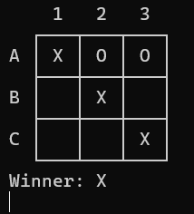

# 🎮 Tic-Tac-Toe in C (Console Game)

This project implements the classic **Tic-Tac-Toe** game in console mode using the C programming language.  
Players take turns making moves, the game checks for valid input, and determines the winner.

---

## 🖼 Game Gallery

<div align="center">
<table>
  <tr>
    <td style="padding: 0 30px;"></td>
    <td style="padding: 0 30px;"></td>
    <td style="padding: 0 30px;"></td>
  </tr>
</table>
</div>

---

## ✨ Features
- Console interface with visual 3×3 board display.
- Players mark moves with **X** and **O**.
- Checks for occupied cells.
- Ability to **restart the game** (`r`) or **quit** (`q`).
- Determines the winner or a **draw**.

---

## 📂 Files
- **index.c** – main program file:
  - Displays the board.
  - Reads user input.
  - Manages player turns.
  - Controls game flow.
- **logic.h** – victory check logic:
  - Checks rows, columns, and diagonals.
  - Returns `1` if the current player wins, `0` otherwise.

---

## 🛠 How to Use

1. **Compile:**
```bash
gcc index.c -o index
```

2. **Run:**
```bash
./index
```

---

## 📄 License
This project is licensed under the MIT License.
